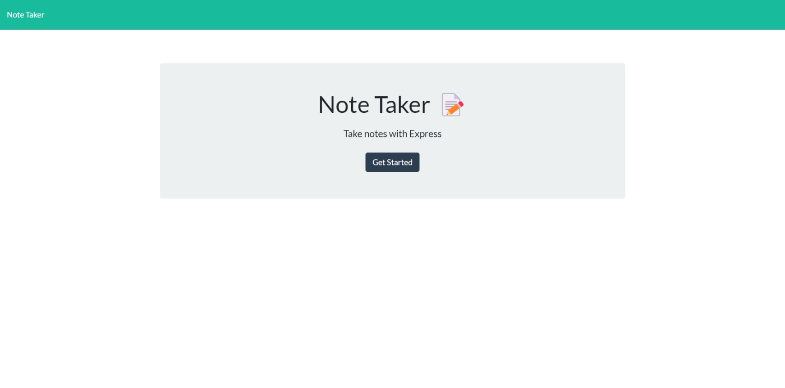

# Note Taker

## User Story
As a busy student, I want to stay organized by writing important tasks and reminders in one accessible place.

## Description
This application will receive user input, and it will save the input data to the page.

Deployed Heroku Url: https://notetaker233.herokuapp.com/

## Technologies
* HTML 
* CSS 
* Javascript
* Node.js

## Installation
Clone the repository and Install npm.

## Usage
This application will be resourceful with staying organized and up to date on tasks. This coud be used as a reminder app, a grocery list, or even a chore to-do list.

## Future Development
* The user would be able to open a specific note and read the contents.
* The user would be able to delete a note.

## Credits
Alexandria Guerrero, https://github.com/Ag6793

## License

MIT License

Copyright (c) [2023] [Alexandria Guerrero]

Permission is hereby granted, free of charge, to any person obtaining a copy
of this software and associated documentation files (the "Software"), to deal
in the Software without restriction, including without limitation the rights
to use, copy, modify, merge, publish, distribute, sublicense, and/or sell
copies of the Software, and to permit persons to whom the Software is
furnished to do so, subject to the following conditions:

The above copyright notice and this permission notice shall be included in all
copies or substantial portions of the Software.

THE SOFTWARE IS PROVIDED "AS IS", WITHOUT WARRANTY OF ANY KIND, EXPRESS OR
IMPLIED, INCLUDING BUT NOT LIMITED TO THE WARRANTIES OF MERCHANTABILITY,
FITNESS FOR A PARTICULAR PURPOSE AND NONINFRINGEMENT. IN NO EVENT SHALL THE
AUTHORS OR COPYRIGHT HOLDERS BE LIABLE FOR ANY CLAIM, DAMAGES OR OTHER
LIABILITY, WHETHER IN AN ACTION OF CONTRACT, TORT OR OTHERWISE, ARISING FROM,
OUT OF OR IN CONNECTION WITH THE SOFTWARE OR THE USE OR OTHER DEALINGS IN THE
SOFTWARE.
